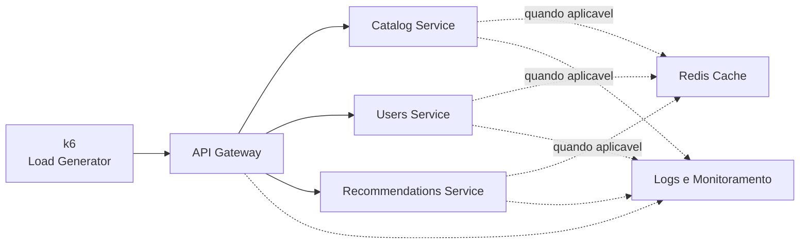

# Análise e Otimização de Desempenho em Sistemas de Streaming de Alta Escala

<p align="center">
  Parte prática do Trabalho de Conclusão de Curso em Ciência da Computação
</p>

<p align="center">
  <strong>CESAR School</strong>
</p>

<p align="center">
  
  
  
  
</p>

---

## Visão Geral

Este repositório concentra a parte prática do TCC **Análise e Otimização de Desempenho em Sistemas de Streaming de Alta Escala**.

A proposta consiste na construção de um ambiente experimental inspirado em sistemas de streaming, baseado em APIs e microsserviços, para investigar o impacto de diferentes estratégias de otimização sobre o desempenho da aplicação.

O foco está na avaliação comparativa de cenários sob carga controlada, observando métricas como latência, throughput, tempo de resposta, taxa de erro e utilização de recursos computacionais.

A implementação prática será **guiada pelo Projeto de Pesquisa e pelos trabalhos de referência**, evitando a construção arbitrária de uma metodologia experimental e buscando preservar a comparabilidade dos resultados com a literatura analisada.

---

## Convenções do Projeto

Para diferenciar decisões já consolidadas daquelas que ainda dependem de detalhamento metodológico ou implementação, este README utiliza a seguinte classificação:

| Situação | Significado |
| --- | --- |
| **Definido** | Elemento já estabelecido pelo Projeto de Pesquisa ou consolidado na documentação disponível. |
| **Previsto** | Elemento previsto para a parte prática, mas que ainda depende de implementação ou detalhamento operacional. |
| **Pendente** | Elemento que ainda exige decisão metodológica ou validação antes da implementação. |

---

## Problema de Pesquisa

Sistemas de streaming de alta escala operam com forte variabilidade de carga, comunicação intensiva entre serviços e elevada dependência de APIs.

Nesse contexto, problemas como latência elevada, gargalos internos, uso ineficiente de recursos e aumento da taxa de erro podem comprometer o desempenho, a escalabilidade e a experiência do usuário.

O trabalho investiga como diferentes estratégias de otimização podem ser utilizadas para melhorar o desempenho de arquiteturas distribuídas, buscando equilíbrio entre eficiência técnica, escalabilidade, resiliência e utilização de recursos.

---

## Questão de Pesquisa

> Como combinar diferentes estratégias de otimização para melhorar o desempenho de sistemas de streaming, garantindo escalabilidade, resiliência e equilíbrio entre eficiência técnica e custo operacional?

---

## Objetivos

### Objetivo Geral

Analisar estratégias de otimização de desempenho em sistemas de streaming de alta escala, considerando eficiência, escalabilidade, resiliência e sustentabilidade operacional.

### Objetivos Específicos

- Analisar desafios de desempenho com foco em latência, escalabilidade e uso de recursos.
- Examinar métodos de diagnóstico e monitoramento, como profiling, tracing e testes de carga.
- Investigar abordagens modernas de otimização aplicadas a arquiteturas distribuídas.
- Comparar estratégias de otimização com base em métricas de desempenho e utilização de recursos.
- Discutir como diferentes estratégias podem contribuir para arquiteturas mais eficientes, resilientes e adaptáveis.

---

## Proposta Experimental

A parte prática consiste na implementação de um protótipo simplificado de sistema inspirado em plataformas de streaming.

O desenho experimental atualmente contempla:

- **Definido e implementado:** `API Gateway` como ponto de entrada da aplicação;
- **Definido e implementado:** três microsserviços: `catalog`, `users` e `recommendations`;
- **Definido:** comparação entre diferentes cenários experimentais;
- **Definido:** cenário baseline, sem mecanismos específicos de otimização;
- **Definido:** cenário utilizando cache por meio do `Redis`;
- **Pendente:** definição final das técnicas que comporão o cenário otimizado;
- **Definido e preparado:** testes de carga utilizando `k6`;
- **Definido:** coleta de métricas relacionadas ao desempenho e ao uso de recursos;
- **Definido:** três execuções para cada combinação entre cenário experimental e padrão de carga.

---

## Arquitetura Experimental

A arquitetura experimental atual é composta por um API Gateway responsável por encaminhar as requisições para três microsserviços independentes.



> **Observação:** o diagrama representa a arquitetura atualmente implementada para baseline e cache. Ele ainda poderá ser refinado quando o terceiro cenário experimental for definido.

---

## Stack Tecnológica

| Categoria | Tecnologia | Situação | Papel no experimento |
| --- | --- | --- | --- |
| Backend |  | **Implementado** | Ambiente de execução dos serviços. |
| Framework |  | **Implementado** | Construção das APIs e microsserviços. |
| Cache |  | **Implementado** | Implementação do mecanismo de cache no `Catalog Service`. |
| Testes |  | **Implementado** | Geração de carga e execução dos experimentos. |
| Observabilidade | Logs e métricas | **Implementado** | Monitoramento mínimo do comportamento da aplicação durante os testes. |
| Ferramentas auxiliares | A definir | **Pendente** | Dependem da consolidação do ambiente experimental. |

A presença dessas tecnologias representa o planejamento atual do TCC e não implica que todas tenham sido utilizadas pelos trabalhos de referência na mesma configuração experimental.

---

## Diretriz Metodológica

A parte prática **não será construída a partir de uma metodologia arbitrária**.

As decisões experimentais serão guiadas pelos trabalhos de referência analisados durante o desenvolvimento do TCC, seguindo três princípios:

1. utilizar procedimentos derivados da literatura quando houver sustentação metodológica direta;
2. adaptar procedimentos ao escopo do TCC quando a reprodução literal não for tecnicamente ou operacionalmente viável;
3. manter como pendentes as decisões que ainda não possuam sustentação suficiente para serem consolidadas.

O objetivo é permitir que os resultados obtidos posteriormente possam ser discutidos e comparados de forma metodologicamente coerente com os trabalhos utilizados como referência.

---

## Base Bibliográfica e Trabalhos de Referência

A base bibliográfica do TCC reúne referências com papéis distintos. Parte delas orienta diretamente a discussão metodológica e experimental, enquanto outras fundamentam conceitos de arquitetura distribuída, microsserviços, APIs, observabilidade, escalabilidade e revisão da literatura. Essa distinção evita tratar toda referência teórica como se tivesse fornecido um setup experimental diretamente reproduzível.

### Referências metodológicas e aplicadas

| Trabalho | Principal contribuição para o TCC |
| --- | --- |
| **Smirnov (2025)** | Diagnóstico de gargalos, profiling, tracing, testes de carga e métricas de desempenho. |
| **Ji et al. (2025)** | Otimização adaptativa de tráfego e análise de sistemas submetidos a alta carga. |
| **Kamau e Myllynen (2025)** | Auto-scaling preditivo e relação entre custo e desempenho em microsserviços. |
| **Pasham (2025)** | Desempenho de API Gateway e discussão sobre arquiteturas serverless. |
| **Munnangi (2025)** | Aplicação de inteligência artificial na otimização de arquiteturas de APIs cloud-native. |
| **Thatikonda (2025)** | Gerenciamento de cache e análise de métricas relacionadas ao desempenho. |
| **Dadi (2024)** | Planejamento preditivo de capacidade e otimização de plataformas de APIs com IA. |

### Revisões e estudos de síntese

| Trabalho | Principal contribuição para o TCC |
| --- | --- |
| **El Bechir, Bouh e Shuwail (2024)** | Revisão de estratégias de otimização de desempenho para aplicações serverless, útil para contextualizar elasticidade, ganhos operacionais e limitações desse modelo. |
| **Wen et al. (2022)** | Revisão sistemática sobre computação serverless, utilizada no TCC para sustentar a discussão sobre escalabilidade, elasticidade e eficiência operacional em arquiteturas modernas. |

### Referências teóricas e arquiteturais

- **Bass, Clements e Kazman (2021):** fundamentos de arquitetura de software.
- **Dean e Barroso (2013):** impacto da latência em sistemas de larga escala.
- **Fielding (2000):** fundamentos arquiteturais de sistemas baseados em rede e APIs.
- **Fowler (2002):** padrões de arquitetura corporativa.
- **Kleppmann (2017):** sistemas distribuídos e aplicações intensivas em dados.
- **Lercher et al. (2023):** evolução de APIs em microsserviços.
- **Newman (2021):** boas práticas para microsserviços.
- **Richardson (2018):** padrões de microsserviços.
- **Sigelman et al. (2010):** tracing distribuído em larga escala.
- **Wohlin (2014):** diretrizes metodológicas para revisão por snowballing.

Esses trabalhos não serão necessariamente reproduzidos integralmente. A proposta é identificar procedimentos compatíveis com o escopo experimental deste TCC e utilizá-los como referência para o desenho e a análise dos experimentos.

---

## Metodologia Experimental

O experimento será estruturado em torno da implementação de uma arquitetura base e da comparação de seu comportamento diante de diferentes configurações e padrões de carga.

### Elementos definidos

- avaliação comparativa entre cenários;
- utilização das mesmas métricas centrais entre as configurações;
- execução controlada dos experimentos;
- três execuções por combinação entre cenário e padrão de carga;
- análise quantitativa dos resultados;
- interpretação dos resultados à luz dos trabalhos de referência.

### Elementos previstos

- coleta de métricas complementares de infraestrutura, como CPU e memória;
- expansão progressiva dos padrões de carga;
- registro visual mais completo dos resultados em gráficos e tabelas.

### Elementos pendentes

- definição final das técnicas do cenário otimizado;
- políticas específicas de cache, como TTL e invalidação;
- aprofundamento estatístico das métricas, caso necessário nas próximas baterias.

---

## Variáveis Experimentais

### Variáveis Independentes

- cenário experimental;
- padrão de carga;
- presença ou ausência dos mecanismos de otimização.

### Variáveis Dependentes

- latência;
- throughput;
- tempo médio de resposta;
- taxa de erro;
- utilização de CPU;
- utilização de memória.

### Variáveis Controladas

Sempre que possível, serão mantidos constantes entre os experimentos:

- arquitetura base;
- serviços disponíveis;
- endpoints avaliados;
- ferramenta de geração de carga;
- ambiente de execução;
- parâmetros de carga utilizados na comparação;
- critérios de coleta das métricas.

---

## Cenários Experimentais

| Cenário | Situação | Descrição |
| --- | --- | --- |
| **Baseline** | **Definido** | Arquitetura base executada sem mecanismos adicionais específicos de otimização. |
| **Cache com Redis** | **Definido** | Mesma arquitetura com utilização de cache para avaliar seu impacto sobre o desempenho. |
| **Cenário otimizado** | **Pendente** | Configuração adicional baseada em estratégias selecionadas a partir dos trabalhos de referência. |

### Cenário Otimizado

O terceiro cenário está **aberto, porém delimitado metodologicamente**.

Sua composição final não será escolhida apenas por conveniência técnica. As estratégias implementadas deverão:

- possuir sustentação nos trabalhos de referência;
- ser compatíveis com o ambiente experimental;
- permitir comparação com os demais cenários;
- ser viáveis dentro do escopo do TCC.

Abordagens como auto-scaling preditivo, reinforcement learning e arquiteturas serverless permanecem relevantes para a fundamentação do trabalho, mas não são consideradas automaticamente parte da implementação experimental.

---

## Padrões de Carga

O Projeto de Pesquisa prevê a avaliação do sistema diante de diferentes comportamentos de carga, incluindo:

- carga constante;
- crescimento gradual;
- picos repentinos de requisições.

Na etapa prática já executada, foram utilizados:

- uma rodada exploratória inicial em rampa no endpoint de recomendações;
- uma bateria mais forte em rampa para `recommendations` e `catalog`, com três repetições por cenário.

---

## Métricas de Avaliação

As principais métricas previstas são:

| Métrica | Finalidade |
| --- | --- |
| **Latência** | Avaliar o tempo necessário para processamento das requisições. |
| **Throughput** | Medir a quantidade de requisições processadas em determinado intervalo. |
| **Tempo médio de resposta** | Observar o comportamento médio das respostas da aplicação. |
| **Taxa de erro** | Identificar falhas durante os diferentes níveis de carga. |
| **CPU** | Avaliar o impacto das configurações sobre processamento. |
| **Memória** | Avaliar o consumo de memória durante os experimentos. |

A literatura analisada também apresenta métricas adicionais potencialmente relevantes, como percentis de latência (`p95` e `p99`) e cache hit rate. A inclusão definitiva dessas métricas será realizada somente após consolidação do protocolo experimental.

Na primeira comparação experimental, foram priorizadas:
- latência média;
- latência `p95`;
- throughput;
- taxa de erro.

---

## Estratégia de Testes

Os experimentos serão executados utilizando `k6` para geração controlada de carga sobre a aplicação.

### Procedimento geral

```text
Definição do cenário
        ↓
Configuração do ambiente
        ↓
Aplicação do padrão de carga
        ↓
Execução do teste
        ↓
Coleta das métricas
        ↓
Repetição da execução
        ↓
Consolidação dos resultados
        ↓
Comparação entre cenários
```

Cada combinação entre **cenário experimental e padrão de carga será executada três vezes**, reduzindo a influência de variações ocasionais sobre os resultados.

Os parâmetros da primeira rodada controlada foram documentados em [test-plan.md](/Users/gabrielmoc/Downloads/TCC%20-%20Gabriel/docs/experiments/test-plan.md).

---

## Análise dos Resultados

Os resultados serão analisados quantitativamente por meio da comparação das métricas coletadas nas diferentes execuções.

A análise deverá observar:

- diferenças de latência entre cenários;
- variação de throughput;
- comportamento da taxa de erro;
- impacto sobre CPU e memória;
- comportamento diante dos diferentes padrões de carga;
- ganhos ou perdas provocados pelas estratégias implementadas.

Os resultados quantitativos serão posteriormente interpretados em conjunto com a literatura, permitindo discutir não apenas **se** determinada estratégia apresentou melhoria, mas também como seu comportamento se relaciona aos resultados descritos pelos trabalhos de referência.

Critérios estatísticos adicionais serão definidos durante a consolidação do protocolo experimental, caso sejam necessários.

---

## Ambiente Experimental

O ambiente será preparado para permitir execução controlada e repetível dos experimentos.

Atualmente estão previstos:

- execução local;
- serviços independentes;
- backend em `Node.js`;
- APIs desenvolvidas com `Express`;
- cache utilizando `Redis`;
- testes de carga utilizando `k6`;
- mecanismos de registro e monitoramento durante as execuções.

Ainda permanecem pendentes de definição:

- sistema operacional de referência;
- estratégia de conteinerização;
- ferramenta definitiva de observabilidade;
- especificação do hardware utilizado nos testes.

Essas informações serão registradas antes da execução experimental para garantir maior reprodutibilidade.

---

## Reprodutibilidade

Um dos objetivos do repositório é permitir que o experimento possa posteriormente ser reproduzido.

Ao final da implementação, deverão estar documentados:

- requisitos de software e hardware;
- versões das tecnologias utilizadas;
- instalação das dependências;
- configuração dos serviços;
- inicialização do ambiente;
- configuração dos cenários;
- execução dos testes;
- parâmetros de carga;
- coleta das métricas;
- organização dos resultados.

---

## Estrutura Atual do Repositório

```text
.
├── gateway/
│
├── services/
│   ├── catalog/
│   ├── users/
│   └── recommendations/
│
├── shared/
│   └── datasets/
│
├── tests/
│   ├── load/
│   └── smoke/
│
├── results/
│   ├── baseline/
│   ├── redis-cache/
│   └── optimized/
│
├── docs/
│   ├── baseline-contract.md
│   ├── cache-scenario.md
│   ├── cache-validation.md
│   ├── experimental-protocol.md
│   └── experiments/
│       ├── test-plan.md
│       ├── first-comparison.md
│       └── figures/
│
└── README.md
```

A estrutura poderá continuar sendo refinada, especialmente quando o terceiro cenário experimental e a parte visual dos resultados evoluírem.

---

## Resultados

> **Status:** primeira entrega experimental concluída para `baseline` e `redis-cache`, com validação manual, rodada exploratória e bateria forte consolidada.

No momento, o repositório já contém:

- validação manual do cenário com Redis pelas rotas públicas do `gateway`;
- primeira bateria controlada com `k6` no `baseline`;
- primeira bateria controlada com `k6` no cenário com `Redis`;
- bateria forte com `k6` nos endpoints `recommendations` e `catalog`;
- comparação inicial documentada em [first-comparison.md](/Users/gabrielmoc/Downloads/TCC%20-%20Gabriel/docs/experiments/first-comparison.md).

Leitura atual dos resultados:
- o ambiente está estável e reprodutível;
- o cache funciona corretamente do ponto de vista funcional;
- o ganho de desempenho ainda não apareceu de forma relevante no dataset e no ambiente atual;
- isso orienta os próximos passos metodológicos, especialmente expansão de dataset, coleta de CPU e memória e definição do terceiro cenário.

Esta seção continuará sendo atualizada para apresentar:

- resultados consolidados das execuções;
- tabelas comparativas;
- gráficos de desempenho;
- comparação entre cenários;
- análise dos ganhos obtidos;
- trade-offs identificados;
- comparação com os trabalhos de referência.

---

## Limitações Atuais

No estágio atual, ainda não estão consolidados:

- técnicas que comporão o terceiro cenário;
- política definitiva de cache para etapas posteriores;
- ferramenta de observabilidade;
- versões finais do ambiente de referência;
- coleta sistemática de CPU e memória;
- resultados de cenários adicionais;
- definição e implementação do terceiro cenário otimizado.

Esses elementos serão definidos progressivamente durante a preparação e implementação da parte prática, sempre buscando manter coerência com a metodologia e com os trabalhos utilizados como referência.

---

## Documentação

A construção deste repositório é orientada principalmente por:

- Projeto de Pesquisa do TCC;
- trabalhos científicos selecionados na fundamentação teórica;
- documentação técnica produzida durante a implementação;
- resultados e artefatos gerados durante os experimentos.

A documentação acadêmica funciona como referência para as decisões metodológicas, enquanto este repositório concentra a implementação, os procedimentos de reprodução e os resultados da etapa experimental.

---

## Contexto Acadêmico

| | |
| --- | --- |
| **Instituição** | CESAR School |
| **Curso** | Ciência da Computação |
| **Natureza** | Trabalho de Conclusão de Curso |
| **Área** | Sistemas Distribuídos e Engenharia de Software |
| **Foco** | Desempenho de APIs e Microsserviços |
| **Autor** | Gabriel Moura de Oliveira Cavalcanti |
| **Orientador** | Matheus Garrido |

---

<p align="center">
  <strong>Trabalho de Conclusão de Curso — Ciência da Computação</strong>
</p>

<p align="center">
  CESAR School
</p>
