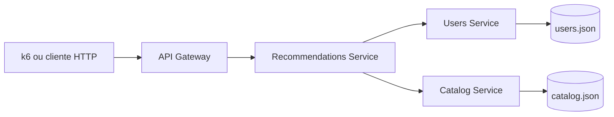
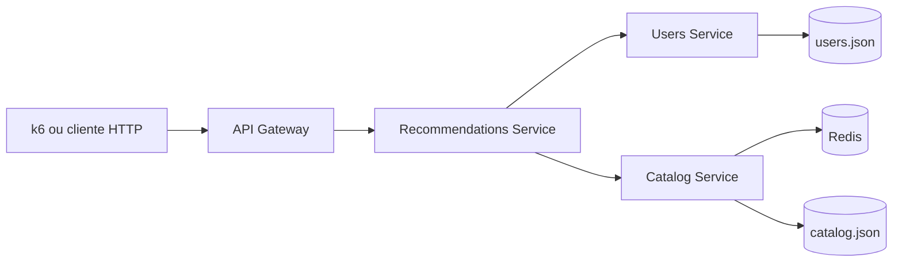
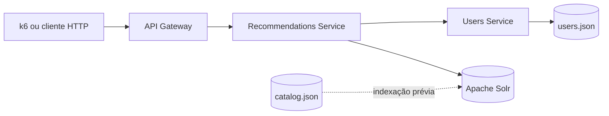

# Arquitetura Final do Artefato

Este documento descreve as três estratégias tecnológicas avaliadas. As rotas públicas, o dataset, a regra de recomendação e o API Gateway permanecem constantes; apenas a recuperação do catálogo varia entre os cenários.

## Baseline

O `Recommendations Service` consulta preferências no `Users Service`, recupera o catálogo completo no `Catalog Service` e filtra os itens compatíveis localmente.

## Cenário com Redis

O `Catalog Service` consulta primeiro o Redis. Em `HIT`, retorna os dados cacheados; em `MISS` ou indisponibilidade, lê o dataset local e preserva o contrato público. O fallback impede que uma falha do Redis interrompa o fluxo de recomendações.

## Cenário com Solr

O catálogo é indexado antes de cada rodada. O `Recommendations Service` consulta o Solr pelos gêneros preferidos do usuário, ordena a resposta pelo identificador do catálogo e preserva os mesmos itens e formato retornados pelo baseline.

## Convenções operacionais

- `GET /api/recommendations/:userId` é o endpoint oficial de carga.
- Logs incluem identificador da requisição, status, duração, origem dos dados, estado do cache e código de erro quando aplicável.
- Respostas de erro têm `code`, `message` e `requestId`.
- A validação de equivalência funcional precede testes de carga em qualquer cenário.
