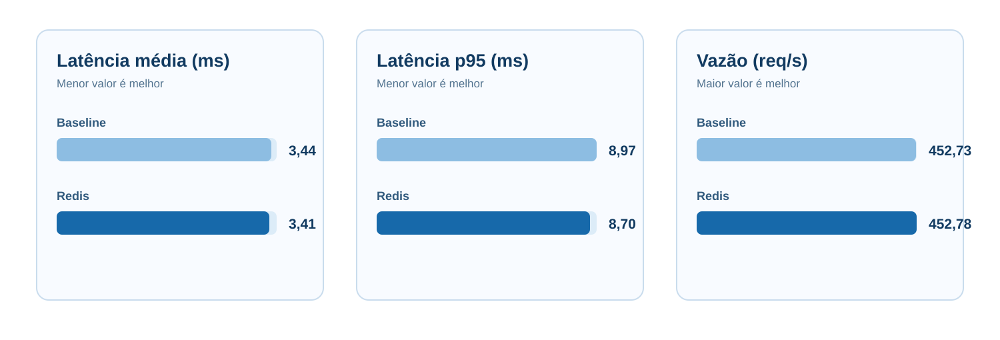
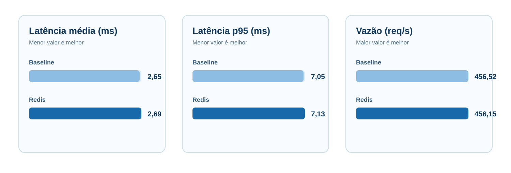
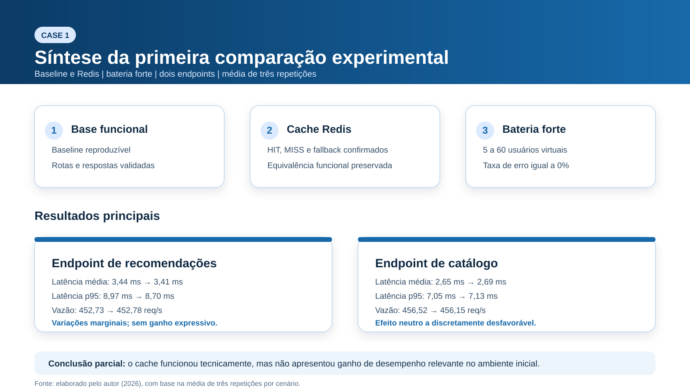

# Primeira Comparação - Baseline vs Redis Cache

## Status

```text
Comparação consolidada em 16/08/2026 com validação manual, rodada exploratória inicial e bateria forte em dois endpoints.
```

## Resumo Executivo

Esta primeira entrega experimental já permite afirmar com segurança que:
- o `baseline` está funcional e reproduzível;
- o cenário com `Redis` no `Catalog Service` está funcionalmente equivalente ao baseline;
- o comportamento de `MISS`, `HIT` e fallback já foi validado;
- a arquitetura permaneceu estável nas baterias executadas;
- o ganho de desempenho ainda não apareceu de forma relevante no ambiente atual.

Em outras palavras: o cache funciona tecnicamente, mas ainda não gerou melhoria expressiva nas métricas de latência e throughput dentro do escopo atual de dados determinísticos locais e dataset reduzido.

## Objetivo

Registrar de forma visual e metodologicamente clara a primeira comparação experimental entre:
- `baseline` sem cache;
- `redis-cache` no `Catalog Service`.

## Artigo de Referência

```text
[Artigo 1] Profiling and Performance Optimization
```

## Escopo Experimental

Endpoint principal:

```text
GET /api/recommendations/:userId
```

Endpoint de apoio:

```text
GET /api/catalog
```

Justificativa:
- `recommendations` representa melhor o fluxo distribuído completo;
- `catalog` ajuda a observar o efeito direto do cache sem o ruído da composição do endpoint principal.

## Validação Já Concluída

Antes da bateria forte, já estavam concluídos:
- validação manual do Redis pelas rotas públicas do `gateway`;
- confirmação de `MISS` na primeira chamada e `HIT` na segunda;
- confirmação de `X-Cache` e `X-Data-Source`;
- confirmação de fallback quando o Redis está indisponivel;
- rodada exploratória inicial em `GET /api/recommendations/:userId`.

As evidências dessa etapa estão em:

```text
results/redis-cache/manual-validation/run-01
results/baseline/ramp/
results/redis-cache/ramp/
```

## Rodada Exploratória

A primeira rodada exploratória foi importante para:
- confirmar a estabilidade funcional do ambiente;
- validar a organização inicial dos resultados;
- mostrar que o efeito indireto do cache em `recommendations` não aparecia de forma clara com carga moderada.

Parâmetros da rodada exploratória:

```text
script: tests/load/recommendations-ramp.js
startVUs=1
targetVUs=15
rampUp=15s
sustain=20s
rampDown=10s
sleep=0.5s
repetições=3 por cenário
```

Resumo exploratorio:

| Métrica | Baseline | Redis Cache | Diferença |
|---|---:|---:|---:|
| Latência média | 4.57 ms | 4.66 ms | +0.09 ms |
| Latência p95 | 7.35 ms | 7.78 ms | +0.43 ms |
| Throughput | 21.75 req/s | 21.75 req/s | -0.01 req/s |
| Taxa de erro | 0 | 0 | 0 |

Essa rodada permaneceu útil como referência inicial, mas foi insuficiente para uma leitura mais convincente.

## Bateria Forte Consolidada

Data:

```text
16/08/2026
```

Padrão de carga:

```text
ramp-strong
```

Parâmetros escolhidos:

```text
startVUs=5
targetVUs=60
rampUp=30s
sustain=60s
rampDown=20s
sleep=0.1s
repetições=3 por cenário e por endpoint
```

Justificativa da escolha:
- é claramente mais forte que a rodada exploratória;
- continua viável e reproduzível em ambiente local;
- gera volume suficiente para leitura comparativa sem introduzir outro tipo de carga ainda não consolidado no protocolo;
- aproxima melhor a entrega do perfil de comparação esperado pelo orientador.

## Recommendations - Bateria Forte

### Tabela de Métricas

| Métrica | Baseline | Redis Cache | Diferença |
|---|---:|---:|---:|
| Latência média | 3.44 ms | 3.41 ms | -0.04 ms |
| Latência p95 | 8.97 ms | 8.70 ms | -0.27 ms |
| Throughput | 452.73 req/s | 452.78 req/s | +0.06 req/s |
| Taxa de erro | 0 | 0 | 0 |
| Requisições medias por run | 49,827.67 | 49,833.67 | +6.00 |

### Visual



### Leitura

- O cache apresentou uma melhora muito pequena em `recommendations`.
- A latência média caiu aproximadamente `1.02%`.
- O `p95` caiu aproximadamente `3.06%`.
- O throughput ficou praticamente idêntico.
- Como a diferença e pequena, a leitura mais honesta e que o sistema ficou estável, mas sem ganho relevante ainda.

## Catalog - Bateria Forte

### Tabela de Métricas

| Métrica | Baseline | Redis Cache | Diferença |
|---|---:|---:|---:|
| Latência média | 2.65 ms | 2.69 ms | +0.05 ms |
| Latência p95 | 7.05 ms | 7.13 ms | +0.08 ms |
| Throughput | 456.52 req/s | 456.15 req/s | -0.37 req/s |
| Taxa de erro | 0 | 0 | 0 |
| Requisições medias por run | 50,241.00 | 50,193.67 | -47.33 |

### Visual



### Leitura

- No `catalog`, o cache também não entregou ganho mensurável nesta bateria.
- A latência média aumentou aproximadamente `1.78%`.
- O `p95` aumentou aproximadamente `1.16%`.
- O throughput permaneceu praticamente no mesmo patamar.
- Isso sugere que, neste ambiente, o custo adicional de serialização e acesso ao Redis pode ter neutralizado qualquer benefício esperado.

## Visão Geral Visual



## Interpretação

Os resultados desta comparação dizem o seguinte:

1. A intervenção experimental foi aplicada corretamente.
   O cenário com Redis está implementado, observável e funcionalmente equivalente ao baseline.

2. O ambiente está estável.
   Todas as rodadas ficaram com taxa de erro zero e throughput consistente.

3. O cache ainda não trouxe ganho expressivo.
   Nem o endpoint principal de `recommendations` nem o endpoint de apoio `catalog` apresentaram melhoria forte o suficiente para sustentar, por enquanto, a afirmação de otimização efetiva.

4. Isso não invalida a entrega.
   Pelo contrário, mostra que o experimento está sendo conduzido com honestidade metodológica: a estratégia foi aplicada, medida e interpretada sem forcar um resultado positivo artificial.

## Por Que o Ganho Ainda Não Apareceu

As explicações mais plausíveis no estado atual do projeto são:
- o dataset ainda e pequeno;
- o acesso ao catálogo local em JSON já e muito barato;
- o endpoint principal depende também de `users` e da composição da resposta;
- o Redis foi introduzido apenas no `Catalog Service`, não em todo o fluxo;
- em ambiente local simples, o overhead adicional do cache pode competir com o custo muito baixo da fonte original.

## Relação com a Literatura

Esta primeira entrega se relaciona bem com o artigo-base porque:
- compara o comportamento antes e depois de uma intervenção controlada;
- mantém a mesma carga funcional entre os cenários;
- trata a observação de desempenho como evidencia empírica, e não como suposição;
- mostra que a simples introdução de cache não garante melhoria automática fora do contexto adequado.

Esse último ponto e importante para o TCC, porque aproxima a discussão de uma leitura mais madura: otimizar arquitetura distribuída não significa apenas adicionar mecanismos conhecidos, mas entender quando eles efetivamente alteram o comportamento observado.

## Limitações Desta Primeira Entrega

A entrega ainda não contempla:
- coleta sistemática de CPU e memória;
- dataset expandido;
- gráficos temporais mais detalhados;
- comparação com rampas ainda maiores;
- terceiro cenário otimizado.

Mesmo assim, ela já e suficiente para:
- mostrar implementação prática concreta;
- demonstrar reproducibilidade;
- apresentar comparação entre cenários;
- justificar os próximos passos com base em evidências reais.

## Próximo Movimento Recomendado

Com base no que foi medido, o próximo movimento metodologicamente mais forte é:
- expandir o dataset mantendo determinismo;
- testar novas cargas mais agressivas;
- observar CPU e memória;
- definir um terceiro cenário cuja mudanca tenha mais chance de aparecer no endpoint principal.

## Resultados Brutos

Rodada exploratória:

```text
results/baseline/ramp/
results/redis-cache/ramp/
```

Validação manual:

```text
results/redis-cache/manual-validation/run-01
```

Bateria forte consolidada:

```text
results/baseline/ramp-strong/recommendations/
results/redis-cache/ramp-strong/recommendations/
results/baseline/ramp-strong/catalog/
results/redis-cache/ramp-strong/catalog/
```
