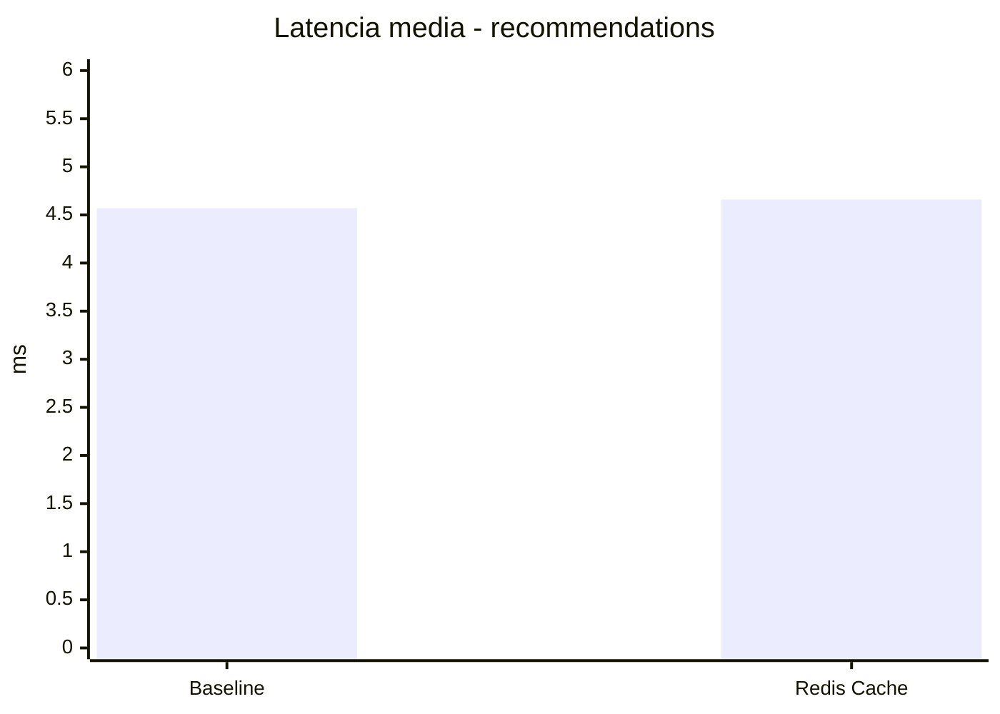
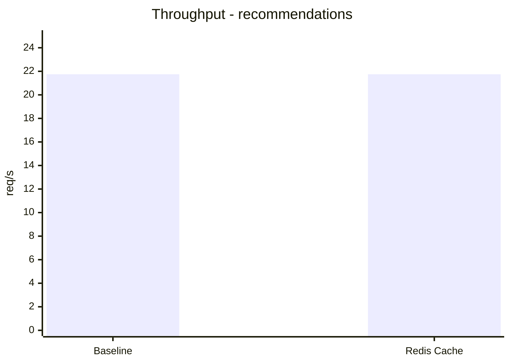

# First Comparison - Baseline vs Redis Cache

## Status

```text
Primeira comparacao inicial preenchida com a bateria controlada de 2026-08-16.
```

## Objective

Registrar de forma visual e objetiva a primeira comparacao experimental entre:
- `baseline` sem cache;
- `redis-cache` no `Catalog Service`.

## Reference Article

```text
[Artigo 1] Profiling and Performance Optimization
```

## Experimental Case

Endpoint principal:

```text
GET /api/recommendations/:userId
```

Endpoint de apoio:

```text
GET /api/catalog
```

Padrao de carga:

```text
rampa
```

Parametros da primeira rodada:

```text
startVUs=1
targetVUs=15
rampUp=15s
sustain=20s
rampDown=10s
sleep=0.5s
repeticoes=3 por cenario
```

## Scenario Description

### Baseline

- sem cache;
- dados obtidos diretamente pelos servicos responsaveis;
- mesma logica funcional do experimento.

### Redis Cache

- cache habilitado no `Catalog Service`;
- mesma rota publica;
- mesma logica funcional;
- mesma carga aplicada.

## Execution Summary

| Campo | Baseline | Redis Cache |
|---|---|---|
| Data da execucao | 2026-08-16 | 2026-08-16 |
| Script utilizado | `tests/load/recommendations-ramp.js` | `tests/load/recommendations-ramp.js` |
| Padrao de carga | rampa | rampa |
| Repeticao | 3 runs | 3 runs |
| Observacoes | sem cache | cache apenas no `Catalog Service` |

## Metrics Table

| Metrica | Baseline | Redis Cache | Diferenca |
|---|---|---|---|
| Latencia media | 4.57 ms | 4.66 ms | +0.09 ms |
| Latencia p95 | 7.35 ms | 7.78 ms | +0.43 ms |
| Throughput | 21.75 req/s | 21.75 req/s | -0.01 req/s |
| Taxa de erro | 0 | 0 | 0 |
| CPU | nao coletado nesta rodada | nao coletado nesta rodada | n/a |
| Memoria | nao coletado nesta rodada | nao coletado nesta rodada | n/a |

## Visuals

Inserir ou referenciar figuras em:

```text
docs/experiments/figures/
```

Sugestoes iniciais:
- grafico de barras para latencia media;
- grafico de barras para throughput;
- grafico simples comparando baseline e cache.

### Mermaid - Latencia Media



### Mermaid - Throughput



## Initial Interpretation

- Nesta primeira bateria, o efeito indireto do cache sobre o endpoint de recomendacoes foi pequeno.
- A latencia media e o p95 ficaram muito proximos entre os cenarios, com leve variacao desfavoravel ao cache nesta rodada.
- O throughput permaneceu praticamente identico.
- Esse resultado sugere que, com dataset pequeno e endpoint principal dependendo tambem de `users` e da composicao da resposta, o ganho local no `catalog` ainda nao se refletiu de forma significativa no fluxo completo de recomendacoes.
- A validacao manual e os testes funcionais continuam mostrando que o ganho direto de `HIT` e `MISS` existe no `catalog`, mas ele ainda nao apareceu como ganho relevante no endpoint principal desta primeira rodada.

## Relation to the Literature

- O aspecto principal observado aqui e a comparacao de desempenho antes e depois de uma otimizacao arquitetural pontual, alinhada com a ideia de profiling e observacao de gargalos discutida no artigo-base.
- O experimento segue a logica do trabalho ao comparar o comportamento do sistema sob a mesma carga funcional, introduzindo uma estrategia de cache como intervencao controlada.
- A adaptacao ao escopo do TCC aparece no fato de que o ambiente e reduzido, com dados deterministicos locais e foco em um fluxo distribuido simplificado de streaming.

## Raw Results

Referenciar os caminhos reais apos a execucao:

```text
results/baseline/ramp/run-01
results/baseline/ramp/run-02
results/baseline/ramp/run-03
results/baseline/ramp/aggregate-summary.json
results/redis-cache/manual-validation/run-01
results/redis-cache/ramp/run-01
results/redis-cache/ramp/run-02
results/redis-cache/ramp/run-03
results/redis-cache/ramp/aggregate-summary.json
```
