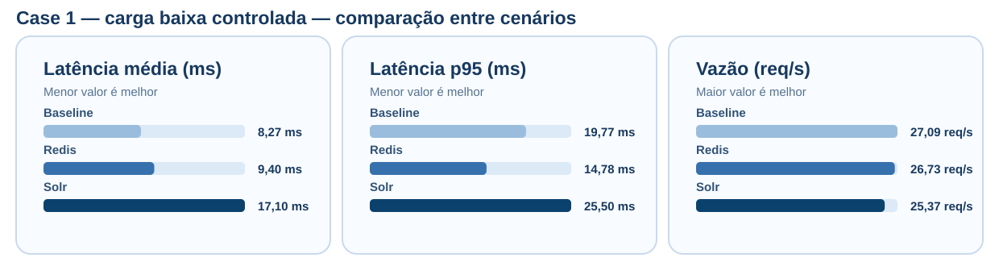
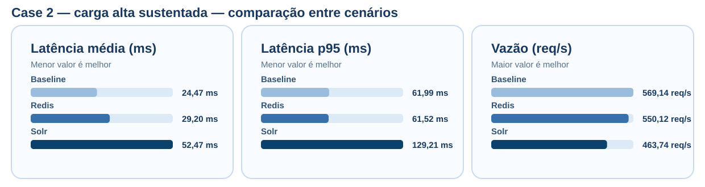
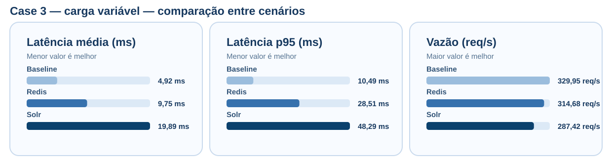

# Comparação Final por Perfil de Carga

Este documento consolida a matriz final entre baseline, Redis e Solr. Cada valor é a média de três repetições do endpoint `GET /api/recommendations/:userId`. Os resultados históricos permanecem documentados separadamente e não são usados nesta comparação.

## Case 1 — carga baixa controlada

| Cenário | Latência média | p95 | Vazão | Taxa de erro | Repetições |
| --- | ---: | ---: | ---: | ---: | ---: |
| Baseline | 8,27 ms | 19,77 ms | 27,09 req/s | 0,00% | 3 |
| Redis | 9,40 ms | 14,78 ms | 26,73 req/s | 0,00% | 3 |
| Solr | 17,10 ms | 25,50 ms | 25,37 req/s | 0,00% | 3 |

**Fonte:** elaborado pelo autor (2026), a partir dos resultados brutos da matriz final.

### Leitura do case

No Case 1 — carga baixa controlada, o menor valor de latência média foi observado no Baseline (8,27 ms), o menor p95 no Redis (14,78 ms) e a maior vazão no Baseline (27,09 req/s). Todos os cenários mantiveram taxa de erro igual a zero. O resultado deve ser interpretado no contexto do dataset local determinístico: a estratégia adicional pode introduzir custo de comunicação, serialização ou consulta sem necessariamente superar a recuperação direta.

## Case 2 — carga alta sustentada

| Cenário | Latência média | p95 | Vazão | Taxa de erro | Repetições |
| --- | ---: | ---: | ---: | ---: | ---: |
| Baseline | 24,47 ms | 61,99 ms | 569,14 req/s | 0,00% | 3 |
| Redis | 29,20 ms | 61,52 ms | 550,12 req/s | 0,00% | 3 |
| Solr | 52,47 ms | 129,21 ms | 463,74 req/s | 0,00% | 3 |

**Fonte:** elaborado pelo autor (2026), a partir dos resultados brutos da matriz final.

### Leitura do case

No Case 2 — carga alta sustentada, o menor valor de latência média foi observado no Baseline (24,47 ms), o menor p95 no Redis (61,52 ms) e a maior vazão no Baseline (569,14 req/s). Todos os cenários mantiveram taxa de erro igual a zero. O resultado deve ser interpretado no contexto do dataset local determinístico: a estratégia adicional pode introduzir custo de comunicação, serialização ou consulta sem necessariamente superar a recuperação direta.

## Case 3 — carga variável

| Cenário | Latência média | p95 | Vazão | Taxa de erro | Repetições |
| --- | ---: | ---: | ---: | ---: | ---: |
| Baseline | 4,92 ms | 10,49 ms | 329,95 req/s | 0,00% | 3 |
| Redis | 9,75 ms | 28,51 ms | 314,68 req/s | 0,00% | 3 |
| Solr | 19,89 ms | 48,29 ms | 287,42 req/s | 0,00% | 3 |

**Fonte:** elaborado pelo autor (2026), a partir dos resultados brutos da matriz final.

### Leitura do case

No Case 3 — carga variável, o menor valor de latência média foi observado no Baseline (4,92 ms), o menor p95 no Baseline (10,49 ms) e a maior vazão no Baseline (329,95 req/s). Todos os cenários mantiveram taxa de erro igual a zero. O resultado deve ser interpretado no contexto do dataset local determinístico: a estratégia adicional pode introduzir custo de comunicação, serialização ou consulta sem necessariamente superar a recuperação direta.

## Síntese comparativa

A matriz não encontrou uma estratégia dominante em todas as métricas e perfis. O baseline obteve a menor latência média e a maior vazão nos três cases; Redis apresentou o menor p95 no Case 1 e uma diferença marginal de p95 no Case 2, mas não superou o baseline nas demais métricas; Solr preservou a equivalência funcional, porém acrescentou custo no ambiente local avaliado. Esses resultados não generalizam para plataformas comerciais de streaming, mas sustentam a conclusão de que cache e indexação devem ser avaliados empiricamente, considerando carga, dados e recursos.

## Limites de interpretação

A comparação é válida para o ambiente local, dataset determinístico, endpoint e perfis de carga descritos no plano mestre. CPU e memória RSS dos serviços Node.js estão nos resumos agregados; as métricas do contêiner Solr são registradas por rodada como evidência complementar e não devem ser comparadas diretamente com o contador de CPU dos processos Node.js.
